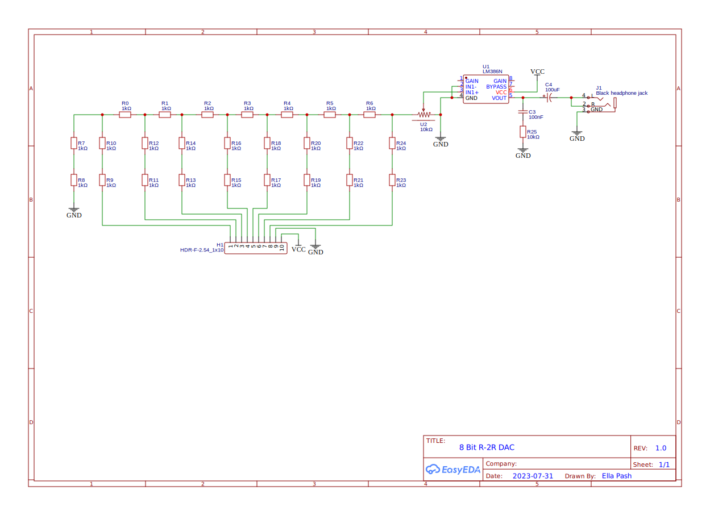

# 8 Bit R-2R Dac
This board is a simple R-2R DAC paired with an amplifier based on a LM386. The amplifier circuit is based on the 20db gain circuit found in on the LM386's [datasheet](./lm386.pdf).

# Schematic

# PCB

# License
This project is under the MIT license. It can be found [here](./LICENSE).
